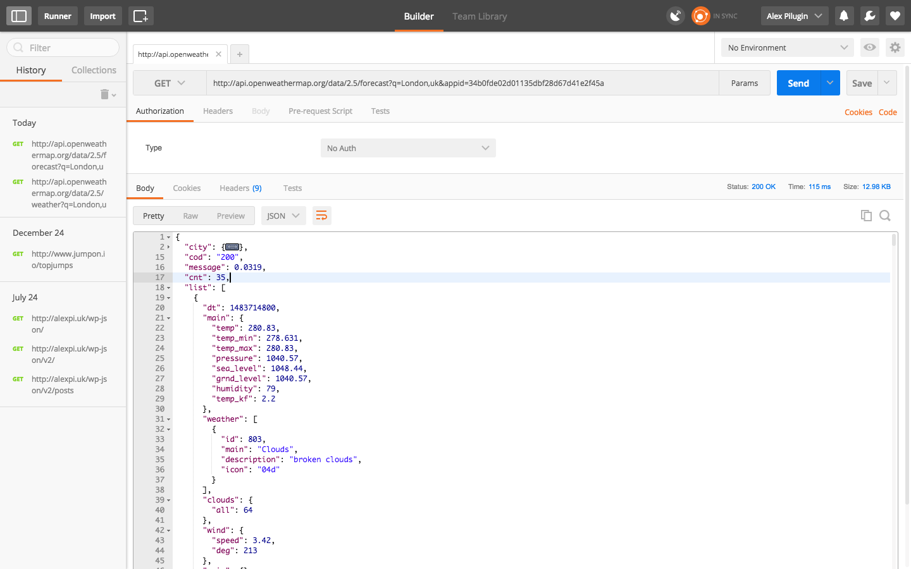

# Alexander Pilugin
Here is my solution of this assignment: 
[org-design: Requirements](https://github.com/buildit/org-design/blob/master/Recruitment/Exercises/js_engineer_contract.md) 

I created two versions: v.01 & v.02
I used Postmap app to send HTTP requests
 
